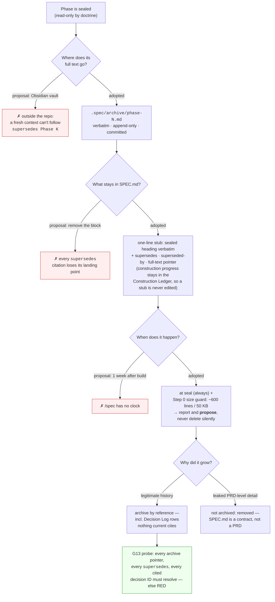

# /spec  - 我要验牌，牌没有问题


**它做什么**：`/spec` 把你含糊的想法问成一份能落地的规格，`/build` 照着规格写码，`/yolo` 让这件事自动跑到绿。

**凭什么信**：每个承重结论背后都挂着一个能真的变红的探针——变不红的检查不算数，所以"绿"是跑出来的，不是 AI 说的。

**你省下什么**：需求不再散在聊天记录里，AI 能查的自己查、能定的自己定并写进决策日志，只在真正的分叉上问你一次。

## 介绍视频 · 1 分 48 秒

https://github.com/user-attachments/assets/589849df-9629-42b7-b2f5-66a5c5d59012

六段，每段讲一个点：

<table>
<tr>
<td width="50%" valign="top">

https://github.com/user-attachments/assets/f78f1e35-e081-403e-9124-9f5e88c7483f

<b>① 问题</b> · 17s<br><sub>需求散在聊天里，一路绿灯却说不清凭什么</sub>

</td>
<td width="50%" valign="top">

https://github.com/user-attachments/assets/6fc0b821-8fa4-4bbe-9c63-b4a6c5e2393f

<b>② 安装</b> · 13s<br><sub>一行装好，只碰 <code>.claude/</code></sub>

</td>
</tr>
<tr>
<td width="50%" valign="top">

https://github.com/user-attachments/assets/805ba9ab-0c4d-4b3f-af45-b3fafbd91920

<b>③ 三道门</b> · 20s<br><sub><code>/spec</code> → <code>/build</code> → <code>/yolo</code></sub>

</td>
<td width="50%" valign="top">

https://github.com/user-attachments/assets/a5176a5b-684b-48ee-b2cb-3bd3ca69c6ef

<b>④ 人机协同</b> · 18s<br><sub>AI 扛重活，只有真分叉才问你</sub>

</td>
</tr>
<tr>
<td width="50%" valign="top">

https://github.com/user-attachments/assets/9adcc4ef-9794-4817-8c15-380954c52ce4

<b>⑤ 核心能力</b> · 20s<br><sub>探针必须能变红，这个绿才算数</sub>

</td>
<td width="50%" valign="top">

https://github.com/user-attachments/assets/f21e70bb-4d31-4b26-bb4c-831b8fed3e96

<b>⑥ 效果</b> · 19s<br><sub>自己管自己，22 条探针全绿</sub>

</td>
</tr>
</table>

<sub>片子用 [HyperFrames](https://github.com/heygen-com/hyperframes) 制作（HTML → 确定性渲染 MP4），
源码与构建说明在 [`video/`](video/)，配音用 NowVoice（云泽·纪录片解说）生成。
上面是 GitHub 的内嵌播放器：README 会过滤 `<video>`／`<iframe>` 标签，只有形如
`github.com/user-attachments/assets/<uuid>` 的链接会被转成播放器，且每条须独占一个段落。
想下载原文件，整片与六个分段也都在
[v2026-09-10 release](https://github.com/suifei/spec/releases/tag/v2026-09-10) 里。</sub>

---

A single, repeatable Claude Code command in which the AI plays an **expert
requirements-elicitation analyst** — it takes your vague idea and turns it into one
authoritative, *feasible* specification.

Think of it like `/init`, but for the living spec. You run `/spec`; it
**clarifies the vague into the clear** through investigation (reads what you point
at, mines your project's data, searches its knowledge and the web, reasons it
through — *investigation is research*), **reflects your idea back organized**,
**offers better views**, and **reports what's closed-loop (ready to build) vs what
you haven't thought through yet**. It then standardizes the result — key content,
boundaries, and anti-patterns — into **`SPEC.md`**. Run it again any time — it
**resumes** from where it left off.

> **What `SPEC.md` is (and isn't):** a **decision & feasibility contract** — the
> load-bearing decisions, gates, boundaries, and anti-patterns. It is *not* a PRD /
> feature list / complete build blueprint; feature-level detail is regenerated by
> `/build` at construction time, never enshrined.

It is **Gate 1** of an AI-assisted development process. **Gate 1.5 is
[`/build`](.claude/skills/build/SKILL.md)** — the construction layer that reads
`SPEC.md` and writes the code from it, keeping the design/tasks plan *ephemeral*
(regenerated each run, never enshrined) so it can't drift, and closing only when
each requirement's acceptance holds and the load-bearing gates are green. The
third command, **[`/yolo`](.claude/skills/yolo/SKILL.md)**, is `/build`'s
autonomous-to-green mode plus a self-terminating loop: it schedules itself
(Claude Code's `/loop` → cron, when available), keeps building to green,
code-reviews each round, and deletes its own loop when nothing buildable
remains — stopping early and handing back to you the moment it hits a genuine
fork, a spec conflict, or two ticks with no progress. It changes `/build`'s
*pace*, never its *rules*. (Gate 2 — extracting a reusable skill from the
finished project — is Claude Code's built-in skill-builder, out of scope here.)

> This repo **dogfoods itself**: its own `SPEC.md` + `.spec/` (from a real `/spec`
> run) specify the `/spec → /build` pipeline.

**The deal:** you weigh in only on the calls that are genuinely yours. The AI does
the heavy lifting — investigating, reasoning, probing, deciding everything that's
decidable, drafting, persisting. `/spec` is collaboration, not paperwork: no forms,
no burden.

## Install

**不用开终端，不用挑系统。**在你的项目里打开 AI 开发工具（Claude Code / Cursor / Codex…），
把下面这行发给它，让它自己装：

```
安装skill https://github.com/suifei/spec/releases/download/v2026-09-10/spec-skills-v2026-09-10.zip
```

它会把 zip 取下来、解进项目的 `.claude/`，然后你就能用 `/spec`、`/build`、`/yolo` 了。

装进去的东西只有 `.claude/skills/{spec,build,yolo}/`、`.claude/commands/{spec,build,yolo}.md`
和 `.claude/spec-install.manifest` —— 你的 `CLAUDE.md`、`SPEC.md`、`.spec/` 一个都不碰
（那些是 `/spec` 自己生成的，属于你）。最新版本见
[Releases](https://github.com/suifei/spec/releases) 页。

<details>
<summary><b>或者自己跑安装脚本</b>（想要脚本化 / CI / 离线固定版本时）</summary>

Run one line **inside your project** to install `/spec` + `/build` + `/yolo` into its `.claude/`.

**Windows** — invokes `powershell.exe` explicitly, so it works pasted into *any*
shell (`cmd.exe`, PowerShell, a Run dialog, a `.bat` file) without you having to
know which one you're in:
```
powershell -NoProfile -ExecutionPolicy Bypass -Command "irm https://raw.githubusercontent.com/suifei/spec/main/scripts/install.ps1 | iex"
```

**Linux / macOS / WSL / Git Bash:**
```bash
curl -fsSL https://raw.githubusercontent.com/suifei/spec/main/scripts/install.sh | bash
```

The Windows installer needs nothing beyond PowerShell 5.1+ itself (falls back to
pure `Invoke-WebRequest` + `Expand-Archive` if `git` isn't on PATH); the Linux/macOS
one uses `git` if present, else `curl` + `tar`. Re-running either upgrades in place.
Then open Claude Code in that directory and run `/spec`.

Prefer a **pinned, offline copy**? Every tagged release ships a
`spec-skills-<tag>.zip` on the [Releases](https://github.com/suifei/spec/releases)
page. Verify its `.sha256`, extract to a temporary directory, then invoke the same
transactional installer with that directory as the source; do not unzip over a project:

```bash
tmp=$(mktemp -d)
unzip spec-skills-*.zip -d "$tmp"
SPEC_INSTALL_SOURCE="$tmp" bash "$tmp/scripts/install.sh" /path/to/project
```

</details>

## How it works

```
/spec ─▶ rehydrate (.spec/STATE.md)         # know exactly where it left off
      ─▶ INVESTIGATE (= research): cache → your material → project data → knowledge → web (+ optional /deep-research for a contested, load-bearing question) → skills/MCP → reason → probe
      ─▶ resolve what you can; register the reasoning (Decision Log)
      ─▶ report findings + closure status (ready vs not-yet-thought-through)
      ─▶ ask only the genuine forks (or a better option found) — low-burden, calibrated
      ─▶ back load-bearing gates with evidence (probes must be able to go red)
      ─▶ persist everything + update CLAUDE.md ─▶ closure seals a phase
```

### Principles

- **Speaks the language you pick — asked once (highest-priority rule).** On first
  persist it asks **one question** — which language for reports and `SPEC.md`
  (default: the language you're writing in; English/中文/日本語/… or other) — then
  **pins it in `SPEC.md` and never asks again**, regardless of what language you
  type in later. On a mismatch with existing content it translates proactively
  (chunked if large). Code/paths/URLs/timestamps stay verbatim. (This repo pins
  English.)
- **Investigation is research (探真 = 研究).** Finding the truth = finding the
  knowledge — by any means (knowledge, web, project data, skills/MCP, reasoning). A
  runnable probe is one instrument, not the definition.
- **Decide what's decidable; ask rarely.** It resolves what it can and registers
  the reasoning, asking you only about a genuine fork evidence can't settle, or a
  better option it found. It never makes you adjudicate commonsense.
- **Honest, including "no".** It refuses the research-proven-infeasible with the
  real reason and names problems in your decisions — it won't spec a known-wrong
  wish to be agreeable. Standing in for market/requirements/feasibility/
  architecture/design-review at once, it pulls top-tier authoritative sources when
  a role needs knowledge it lacks.
- **Gates are load-bearing only.** A gate is a truth a real decision *hinges* on.
  Commonsense facts (a free port, a writable dir, a tool on PATH) are never gates
  and never a coding focus — *we don't build around whether a port is free.*
- **Evidence, never fabrication.** A load-bearing gate is backed by a probe that
  can go red, or a cited source (marked WEAK) when it can't be scripted.
- **The filesystem is memory.** State lives on disk, not in the context window —
  so it runs reliably in a small window and **resumes** across resets/compaction.
  Reconnaissance persists (`.spec/knowledge/`) so it isn't re-explored.
- **The spec line.** The spec governs the *contract surface* (behavior, contracts,
  load-bearing gates, NFRs, declared constraints, boundaries, anti-patterns) —
  never implementation detail. Code stays free below the line.
- **Phases emerge from closure**, they aren't pre-planned; sealed phases are
  read-only (corrections open a new, superseding phase).
- **Honest limit.** `SPEC.md` is a *lower bound on verified truth*, not a
  correctness proof.

## Usage

```
/spec                                  # create, or resume where it left off
/spec add multi-tenant support         # fold in an idea, then converge
/spec read ./legacy-service and spec the rewrite   # point it at material to scout
/build                                 # construct the next phase from SPEC.md (propose-then-apply)
/yolo                                  # let /build loop autonomously to green; self-reviews, self-terminates
```

`SPEC.md` and `.spec/` are generated on first run. The ideal day-to-day shape:
`/spec <your idea>` to converge on the contract, then `/yolo` to let construction
run to green while the gates keep it honest.

## Examples

> **`examples/self-evolving-agent/`** — produced by an **actual `/spec` skill
> invocation** (the skill drove the run): real research of the authoritative
> literature, a real probe, and the **forks decided by the human in the loop**. It
> establishes the subject first (a "self-evolving agent" is an *objective-gated
> propose→evaluate→select→archive loop*, not "an LLM that edits itself"), verifies
> the one behavioral invariant with a probe (an objective gate rejects regressions),
> and — when the human picked the riskier auto-promote option — **honestly hardened
> it** (mandatory held-out eval + rollback + kill-switch) instead of rubber-stamping.
> `./verify.sh` → 26 assertions, `ALL PASS`.
>
> **`examples/web-claude-code/`** (below) was **hand-authored to model** the skill's
> output — its probes and research are real, but it was not produced by invoking the
> skill. Kept as a worked illustration of the format.

A complete `/spec` run is captured under
[`examples/web-claude-code/`](examples/web-claude-code/) as a worked illustration,
on a deliberately **knowledge-heavy** brief: *"develop a Web version of Claude
Code."* It also captures a real **mistake-and-correction** that shows the discipline
working: a first draft jumped to "build an agent backend" — designing the *how*
before establishing *what Claude Code is* (**define the noun before the verb**). The
corrected spec **establishes the subject first** from official docs (Claude Code is
an agentic **CLI** with a takeover-able I/O surface), and so finds the real core
problem: *"to web" = take over the existing CLI's I/O (PTY or `stream-json`) and
relay it to the browser over WebSocket — not rebuild the agent.* Two gates are
settled by cited research (the subject; the credential boundary), the one behavioral
truth (a CLI's stdio can be taken over and relayed) by a runnable probe with a
negative control, and the old framing is honestly **superseded**. Run `./verify.sh`
there for the probe + 24 assertions (`ALL PASS`, exit 0). Its README carries an
objective value assessment.

## Files

```
.claude/
├── skills/
│   ├── spec/
│   │   ├── SKILL.md                    # the /spec procedure (investigate → ask → decide → probe → persist → resume)
│   │   └── references/
│   │       ├── questioning.md          # how to ask (Socratic, info-gap, low-burden, calibrated)
│   │       ├── probes.md               # how to probe (evidence + mandatory negative control)
│   │       ├── SPEC.template.md        # structure of SPEC.md
│   │       ├── STATE.template.md       # the .spec/STATE.md progress ledger
│   │       └── knowledge.template.md   # a .spec/knowledge/ reconnaissance entry
│   ├── build/SKILL.md                  # the /build procedure (Gate 1.5: spec → code)
│   └── yolo/SKILL.md                   # the /yolo procedure (autonomous construct-to-green loop)
├── commands/spec.md                   # /spec slash-command wrapper
├── commands/build.md                  # /build slash-command wrapper
├── commands/yolo.md                   # /yolo slash-command wrapper
scripts/install.ps1                    # one-line installer (Windows, run via powershell.exe)
scripts/install.sh                     # one-line installer (Linux/macOS/WSL/Git Bash)
CLAUDE.md                              # declares SPEC.md the supreme, read-first reference
docs/DESIGN-NOTES.md                   # full design rationale: discussion rounds + decision log
docs/PAPER.md                          # academic paper (English): design, method, empirical study, with figures/tables
docs/PAPER-short.md                    # short-paper (English): conference-style condensation of PAPER.md
docs/PAPER.zh-CN.md                    # academic paper (Chinese): full translation of PAPER.md, with figures/tables
docs/USER-GUIDE.zh-CN.md               # usage manual (Chinese): when to use it, scenarios, strategy, philosophy
docs/RESEARCH-REPORT.zh-CN.md          # research report (Chinese): background, pain points, decision context

# this repo dogfoods itself — produced by a real /spec run:
SPEC.md                                # the spec (the /spec → /build pipeline)
.spec/STATE.md                         # progress ledger (resumability; incl. the /build-owned ## build section)
.spec/investigation.log                # append-only trail: consulted source → conclusion (internal)
.spec/knowledge/<topic>.md             # persisted reconnaissance (pinned deps/facts)
.spec/probes/<gate>.sh                 # executable probes
.spec/evidence/<gate>-<ts>.log         # captured probe output
.spec/archive/phase-<N>.md             # sealed phases' full text, compacted out of SPEC.md by reference (stub stays)
```

## What changed in v2026-09-10 — sealed history is compacted by reference

**The problem (an engineering one, not a doctrinal one).** In a large project
`SPEC.md` keeps growing, and it is not read once: `/spec` re-reads it every run,
`/build` every run, `/yolo` every tick. A 150 KB spec is ~40k tokens of fixed cost
*per tick*. A user raised this with a concrete proposal (archive sealed phases to
an Obsidian vault on size/time triggers). The direction was right; three details
had to change to fit the model. The revision logic:



Rehydration now reads the **current contract** (`SPEC.md` + `STATE.md` +
knowledge) and opens `.spec/archive/` only when following a pointer. The rule is
gated, not honor-system: `.spec/probes/G13-archive-pointers.sh` goes red on a
dangling pointer, a `supersedes` naming a phase with no stub, or a cited decision
defined nowhere. This repo dogfoods it — Phase 2's body now lives in
`.spec/archive/phase-2.md`. Full reasoning: `docs/DESIGN-NOTES.md` round 46 / D-87.

**Thanks to 周先生 (Mr. Zhou)** for raising the problem with a concrete, well-argued
proposal — the kind of real-world engineering feedback this project needs. The
parts we changed are documented above; the core insight ("sealed = frozen =
archivable") was his.

## Design rationale

`docs/DESIGN-NOTES.md` records the whole design conversation — from "port OpenSpec"
to this expert-analyst, resumable, single-command Gate 1 — plus a consolidated
decision log. `docs/RESEARCH-REPORT.zh-CN.md` is a structured Chinese-language
synthesis of that conversation (background, pain points, decision context) for
readers who want the thinking without the round-by-round log. `docs/USER-GUIDE.zh-CN.md`
is a Chinese-language usage manual — when to reach for `/spec` vs `/build`, worked
scenarios (real and illustrative, clearly labeled), strategy, anti-patterns, and
the engineering philosophy behind the design.

For an academic treatment — the drift and hollow-green problems, the
Intent/Acceptance/Method + falsifiable-probe + intent-review model, the consistency
lens, and the empirical study (dogfooding, non-programming evaluation, adversarial
review, representation blind-study) — see `docs/PAPER.md` (with figures/tables), or
`docs/PAPER-short.md` for a conference-style condensation. A full Chinese
translation is in `docs/PAPER.zh-CN.md`(中文全文).
