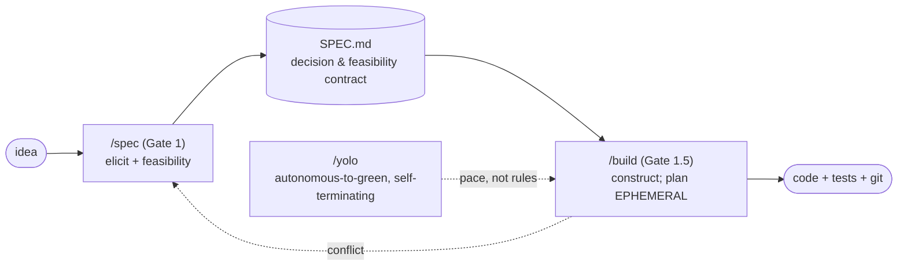
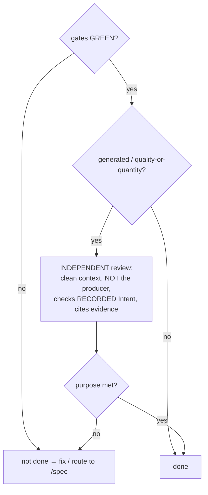
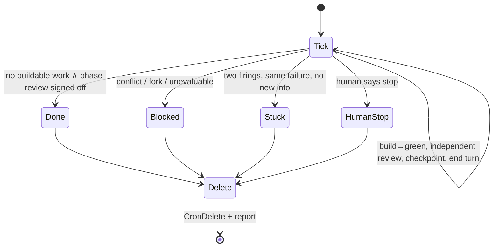

# Specification as Contract: Falsifiable Gates and Intent Review against Spec Drift and Hollow Green

*Short paper (≈6–8 pp.). Companion to the full version in [`PAPER.md`](./PAPER.md).*

## Abstract

AI-assisted development generates code fast but suffers two systemic failures: **specification drift** (a persisted intermediate design/task layer diverges from real code) and **hollow green** (checks pass while the requirement's intent is unmet — an unmounted component, filler-padded prose, a silently skipped behavior — Goodhart's law in construction). We present `/spec` → `/build` → `/yolo`, a three-gate pipeline that (1) persists only a **decision-and-feasibility contract** and regenerates the drift-prone plan every run, (2) gives each requirement an **Intent/Acceptance/Method** triple verified by **falsifiable probes + an independent intent review**, and (3) elicits load-bearing gates cross-domain via a **consistency lens** of eight universal laws. We validate by dogfooding, two non-programming projects, adversarial review, and a representation blind-study, and we state the method's boundaries.

## 1. Problem

Two intertwined pathologies dominate LLM-in-the-loop construction:

- **Drift.** The more complete the persisted intermediate documentation, the more expensive it is to keep true as code evolves.
- **Hollow green.** "Done = checks pass" makes the LLM an **optimizer** that satisfies the cheapest reading of a proxy check while diverging from intent.

Neither yields to patches ("more docs," "more check items"); both require a *structural* fix.

## 2. Pipeline

*Figure 1. One authoritative contract; `/yolo` is a pace switch on `/build`; conflicts route back to `/spec`, never a silent patch.*

**Contract, not PRD.** `SPEC.md` holds only load-bearing content — decisions, gates, boundaries, anti-patterns, requirements, decision log, phase ledger — and *not* a feature list or build blueprint. Feature detail is regenerated at construction time. This is drift-surface minimization: what changes with the implementation never enters the contract.

## 3. Two-layer verification

Each load-bearing requirement carries `{ Intent, Acceptance, Method }`. **Intent** ("what counts as a violation," tagged `[auto]`/`[human]`) is first-class — it is what the review checks against. **Method** ∈ `Probed(.sh + negative-control) | OPEN | WEAK`, its modality derived from the acceptance:

| Acceptance nature | Method |
|---|---|
| pure logic / function | Probed (unit) |
| service / API / cross-process | Probed (integration) |
| user-visible / interaction | Probed (E2E) at the **real entrypoint**; neg-control breaks wiring/reachability |
| quantity / threshold | **floor**: Probed anti-degeneracy (neg-control = the cheat) **∧** independent review |
| unscriptable quality | WEAK (cited / judged) |

*Table 1. Acceptance-kind → Method.*

**A gate is a proxy for an intent.** Author it adversarially (pre-mortem: "cheapest artifact that passes while missing the intent?") → harden the measure (make the cheat the negative control) or add an intent review. For generated/quality work, green gates are necessary but not sufficient:

*Figure 2. Defense in depth: a cheap hardened measure catches crude gaming; the independent intent review catches the subtle miss a probe cannot. A green measure with no intent review is how a gamed artifact ships.*

**Gate discipline.** A gate must be **load-bearing ∧ uncertain ∧ consequential-if-wrong**; commonsense facts are never gated. On any spec change the probe set reconciles (new→author, changed→replace, superseded→retire); a coherence meta-probe guards "every locked-Probed requirement has a probe; no orphans."

## 4. The consistency lens

To stop "which gates?" from depending on the analyst knowing the domain, a basis of eight laws is swept, **derive-first / ask-sparingly / human-owns-intent**:

| # | Law | Cross-domain form |
|---|---|---|
| 1 | Non-contradiction | canon · contracts/invariants · settled results |
| 2 | Lawful change | monotone rank · state machines/migrations · converging estimate |
| 3 | Conservation | items/currency · memory/budget · error budget |
| 4 | Closure | foreshadowing paid off · TODOs · hypotheses tested |
| 5 | Referential integrity + reachability | relationships · call graph/wiring · citations |
| 6 | Boundary & visibility | fair-play knowledge · access control · train/test leakage |
| 7 | Genuine progress | no filler · milestones truly close · uncertainty drops |
| 8 | Provenance | summaries · commits · lab notebook |

*Table 2. Laws 1–6 govern state, 7 is the goal (intent review lives here), 8 is the substrate.*

## 5. `/yolo`: autonomous, self-terminating

*Figure 3. Gate-judged done; deleting the loop is part of done (a forgotten cron is the one way `/yolo` can harm); it changes pace, never rules.*

## 6. Evaluation

Method mirrors the pipeline: **mechanical measure + independent judge**.

- **Dogfooding.** The repo specifies itself; `G2-done-by-gate.sh` judges Phase 2.
- **Non-programming (generality).** Full pipeline on an English novella and a 100-chapter Chinese web-novel (all original). Observer-mode runs surfaced real gaps, fixed *architecturally*: a canon-consistency gate family for growing corpora; an anti-degeneracy floor after an LLM padded chapters with `——` to game a word count; the hoist of that patch to the principle "a gate is a proxy"; and Intent promoted to a first-class field.
- **Adversarial review.** Novel cheats not enumerated by any probe were caught by the independent intent review across rounds, zero false positives — a *structural*, not mathematical, guarantee.
- **Representation blind-study.** Six expressions of the gate doctrine, all 8/8 fidelity for a strong reader; objective is `value = fidelity × human-editability ÷ size`. Converged rule: **structural cores → legend-free arrows / light pseudocode; motivation → prose**, then applied back to the skills and shown behavior-neutral by equivalence regression.

| Representation | vs prose | Fidelity | Editability |
|---|---:|:---:|---|
| Prose | 100% | 8/8 | verbose |
| Pseudocode | −15% | 8/8 | best for coders, no legend |
| Text+arrows | −52% | 8/8 | strong, no legend |
| Mermaid | −45% | 8/8 | great rendered, brittle source |
| Math | −49% | 8/8 | precise, diff-invisible flips |
| Invented DSL | −68% | 8/8 | unreadable without legend |

*Table 3. Fidelity and editability rank the compact forms oppositely; arrows/pseudocode win on value.*

## 7. Limitations

Coverage completeness is unprovable (a green board is a lower bound); the intent review is structural, not mathematical; it depends on a strong reviewer model (small per-cell samples); human intent remains an input the method elicits but cannot decide. Traceability of the intermediate layer is traded for zero drift — re-weigh for audit-heavy settings.

## 8. Conclusion

In an era where the LLM is an optimizer, "done" cannot mean "checks pass"; it must mean **intent achieved, verified against the recorded intent by an independent viewpoint with no incentive to pass its own shortcuts, evidenced by citation**. The `/spec`→`/build`→`/yolo` pipeline operationalizes this with a contract that cannot drift, falsifiable gates, and an intent review — defense from principle, not enumeration.

*Full treatment, figures, and provenance: [`PAPER.md`](./PAPER.md); design log: [`DESIGN-NOTES.md`](./DESIGN-NOTES.md); evidence: [`../eval/`](../eval/).*
