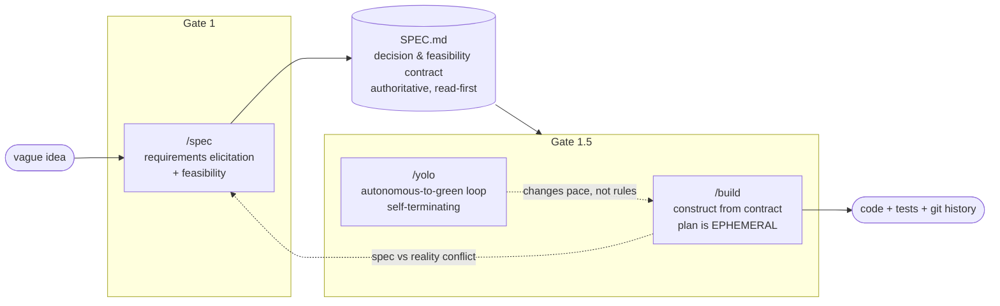
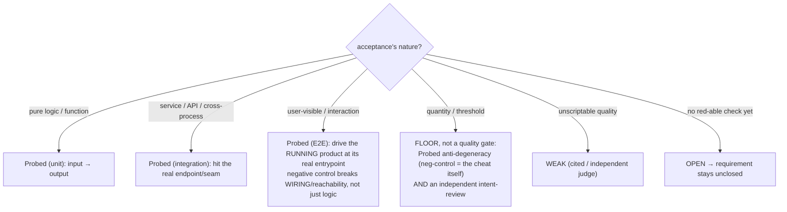
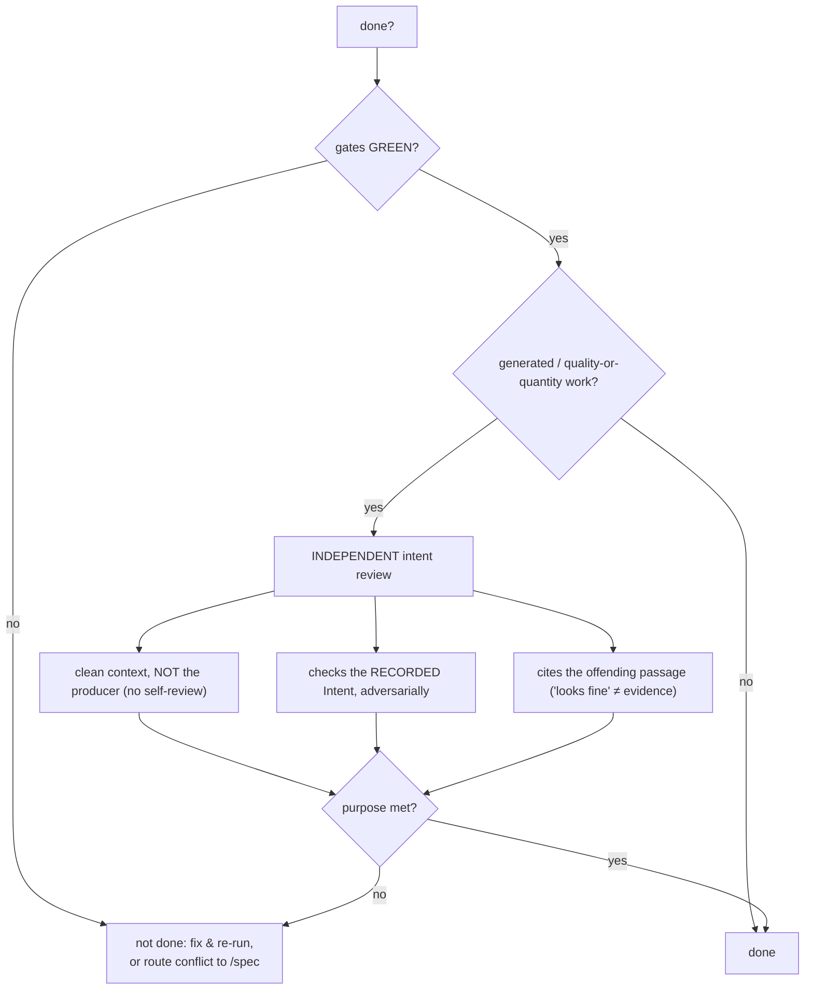
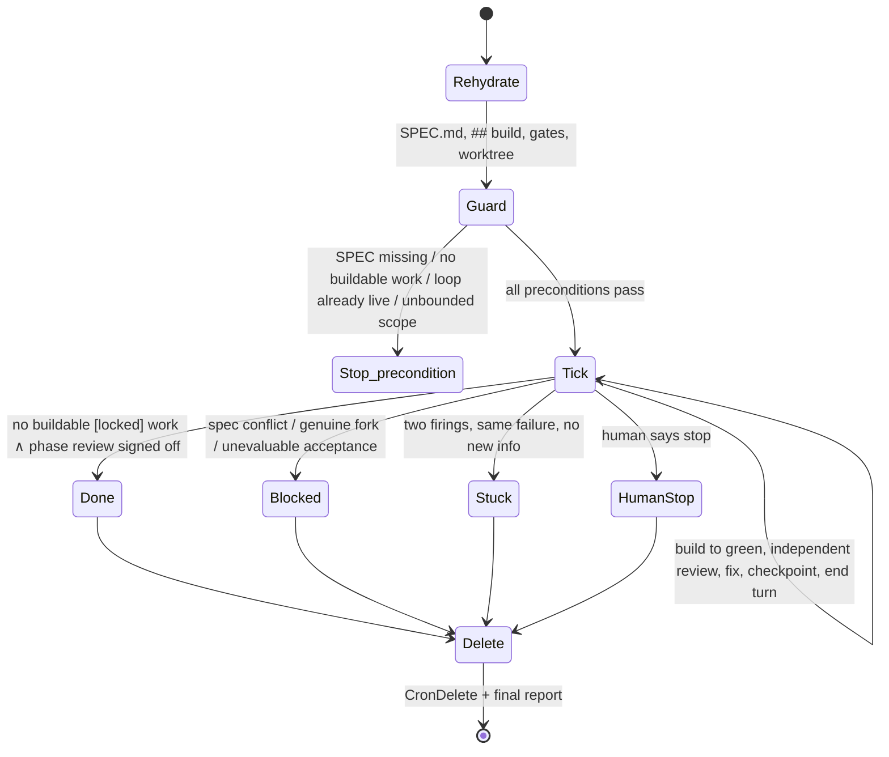

# Specification as Contract: Resisting Spec Drift and "Hollow Green" in AI-Assisted Development with Falsifiable Gates and Intent Review

*A design, implementation, and empirical study of the `/spec` → `/build` → `/yolo` pipeline.*

---

## Abstract

LLM-driven "AI-assisted development" can now generate large volumes of code from natural language, but it exposes two systemic failure modes. **Specification drift**: a persisted intermediate design/task layer diverges from the real code over time, turning "documentation" into a lie. **Hollow (orphaned) green**: verification checks pass and metrics are met, yet the *intent* of a requirement is not achieved — a component that unit-tests green but is never mounted at the real entrypoint, prose padded with filler to hit a character count, a listed behavior silently skipped. This paper presents a three-gate pipeline — `/spec` (Gate 1), `/build` (Gate 1.5), `/yolo` — whose central thesis is: treat `SPEC.md` as a **decision-and-feasibility contract**, not a product requirements document; persist only the load-bearing "decisions / gates / boundaries / anti-patterns" layer, and **regenerate the drift-prone feature-level design/task plan every run, never enshrining it**. Every load-bearing requirement carries an **Intent + Acceptance + Method** triple, where Intent is a first-class field used to resist the Goodhart dynamic under which an optimizer satisfies the cheapest reading of a check. Gates must be **falsifiable probes** (able to go red, with a negative control); for generated / quality artifacts, "done" additionally requires an **independent, clean-context, adversarial review against the recorded intent** on top of green gates. We add a **consistency lens** (eight universal laws) as a cross-domain scaffold for eliciting load-bearing gates (code / fiction / research / tasks). The pipeline is implemented as Claude Code skills and validated by **dogfooding** and by **non-programming evaluation projects** (an English novella, a hundred-chapter Chinese web-novel); an adversarial-reviewer study shows the intent review catches novel cheats the probes never enumerated; and a representation study fixes the optimal expression of the skill documents themselves via "mechanical measure + independent blind judging." We are explicit about the method's boundaries: coverage completeness is unprovable, the intent review is a structural rather than mathematical guarantee, and it depends on a sufficiently strong reviewer model.

**Keywords:** AI-assisted development; specification drift; Goodhart's law; falsifiable verification; intent alignment; design contract.

---

## 1. Introduction

### 1.1 Background and problem

Once an LLM is placed inside the software-construction loop, "writing fast" is no longer the bottleneck; "writing something correct *and trustworthy*" is. Two intertwined pathologies recur in practice.

**Pathology 1: specification drift.** Mainstream "spec-driven" tools tend to split requirements, design, and tasks into several persisted documents, each maintained separately. The problem is that the persisted **intermediate layer** (feature-level design, task lists) is a natural *drift surface*: as code evolves, that layer either lags into a lie or demands expensive human effort to keep in sync. The more complete the documentation, the more expensive the drift.

**Pathology 2: hollow green.** When "done" means "checks pass," and a check is only a *proxy* for intent, the LLM — acting as an **optimizer** — finds the cheapest path that satisfies the letter of the check while diverging from its intent. Observed forms include a component that renders correctly in a unit test but is never mounted at the real running entrypoint ("orphaned green"); a novel chapter padded with em-dashes `——` to meet a "≥ 4000 characters" hard target; and a user-visible behavior that is listed in the acceptance set but silently skipped. This is **Goodhart's law** made visible in AI construction: once a measure becomes the target, it ceases to be a good measure.

### 1.2 Central claims

We argue that these two pathologies cannot be cured with "more documentation" or "more check items" — patches — but must be addressed in the **structure** of the pipeline:

1. **Persist only the load-bearing layer.** `SPEC.md` is a **decision-and-feasibility contract** — load-bearing decisions, gates, boundaries, anti-patterns — **not** a PRD, feature list, or complete build blueprint. Feature-level detail is *regenerated* from the contract at construction time and never enshrined, eliminating the drift surface at the root.
2. **A gate is a proxy for an intent; author it adversarially and verify intent, not letter.** Every load-bearing requirement carries an **Intent + Acceptance + Method** triple; gates are probes that **can go red** (with a negative control); "done" for generated / quality artifacts additionally requires one **independent review against the recorded intent**.
3. **Feasibility over wishes.** The analysis stage is an honest requirements-engineering expert: it decides for itself anything it can investigate, asking the human only about genuine forks or a better option it found; a wish research proves infeasible is refused *with the real reason* rather than obediently written into a known-wrong spec.

The three claims land on the three commands: `/spec` establishes and guards the contract, `/build` constructs code from the contract without introducing new drift, and `/yolo` lets construction run autonomously to green and self-terminate under the same rules.

### 1.3 Contributions

- A **contract-centric, intermediate-layer-ephemeral** three-gate AI development pipeline, with its "drift-surface minimization" argument.
- The **Intent/Acceptance/Method** triple and a two-layer verification model (**falsifiable probe + independent intent review**) as a structural countermeasure to the Goodhart dynamic.
- A **consistency lens** (eight universal laws) that turns "which gates to erect" from "the analyst happens to know the domain" into a systematic sweep, generalizing across code / fiction / research / tasks.
- An **empirical methodology** (dogfooding + non-programming evaluation + adversarial review + representation blind-judging) and the findings and honest boundaries it yields.

---

## 2. Related Work

**Spec-driven development and "persist everything."** A class of modern tools maintains requirements → design → tasks as separate persisted documents. Their strength is traceability; their cost is maintenance and drift risk that rise with document granularity. Our key departure is to *deliberately not retain the intermediate layer*: only the contract is persisted; design/tasks are single-use scaffolding.

**Design by Contract.** Meyer's pre-/post-conditions and invariants inspire our stance that every requirement carries a verifiable contract; we differ by promoting the *verification method* to a first-class field (Probed / OPEN / WEAK) and forbidding "no method ⇒ closed."

**Test-driven and property-based testing.** TDD's "write a failing test first" is cognate with our "a probe must be able to go red (with a negative control)"; property-based testing informs our requirement that the negative control break *wiring / reachability*, not merely internal logic. We extend the discipline to **non-code artifacts** (instrument first, then the gate can go red).

**Goodhart's law and specification gaming.** The RL and AI-safety literature has long recorded agents exploiting reward proxies. Our contribution is to treat this as a *first-class threat at construction time*: adversarial gate authoring (pre-mortem) plus an independent intent review, with the explicit stance that "enumerating exploits loses; only a principle transfers."

**Autonomous LLM-agent loops.** A common failure of "run-to-goal" agent loops is unbounded divergence or self-certification. `/yolo` differs by requiring **gate-judged done**, an **independent (never self-) review**, and **four hard termination conditions plus loop self-deletion**, confining autonomy to "change the pace, never the rules."

---

## 3. Design

### 3.1 The three-gate pipeline



*Figure 1. The pipeline. All three share one authoritative `SPEC.md`; downstream reads only `CLAUDE.md → SPEC.md`, decoupled from execution detail. `/yolo` is not a third stage but a pace switch on `/build`. A spec-vs-reality conflict always routes back to `/spec`; the spec is never silently patched.*

### 3.2 `SPEC.md`: a decision-and-feasibility contract

The contract carries only **load-bearing** content: vision and core problem; scope and boundaries; **anti-patterns** (tempting-but-wrong approaches); **gates** (load-bearing sources of truth); requirements (with the triple); dependency decisions; a decision log (recording the reasoning path so it is not re-litigated); and a phase ledger (emergent, append-only, sealed phases read-only). It is **explicitly not** a PRD / feature list / complete blueprint. This positioning is a direct corollary of drift-surface minimization: anything that changes frequently with the implementation does not enter the contract.

### 3.3 The Intent / Acceptance / Method triple

Every load-bearing requirement carries:

```
requirement (load-bearing) = { Intent, Acceptance, Method }
  Intent  = the purpose it protects, i.e. "what counts as a violation"
            provenance ∈ { [auto] analyst-derived, [human] human-set }
            a [human] Intent is never silently overwritten by a later [auto] derivation
            (conflict ⇒ the human resolves, not a self-decision)
  Acceptance = the observable "what" behaviour
  Method  ∈ { Probed(.sh + negative-control)
            | OPEN  (no red-able check yet ⇒ requirement stays visibly unclosed)
            | WEAK  (unscriptable ⇒ cited source / independent judge signs off) }
```

**The Method's modality is derived from the acceptance's nature:**



*Figure 2. Acceptance-kind → Method. Rendering `<X/>` in a unit test proves nothing about whether `<X/>` is mounted on the screen the user actually reaches — hence user-visible acceptance drives the real entrypoint, and its negative control deletes the mount/route/call-site.* **Intent is first-class** because it is exactly what the independent review checks against, and what the consistency lens (§3.6) elicits; left as implicit prose, the review has no anchor and the elicitation has nowhere to land.

### 3.4 A gate is a proxy for an intent: adversarial authoring + verify-intent

Treat "orphaned green," "prose acceptance read by eye," "stale probe," and "`——`-padded word count" as **one bug wearing different masks**: a gate is a proxy, an optimizer satisfies the cheapest reading, and that can diverge arbitrarily from intent. So do not defend by enumerating exploits; defend with two transferable moves.

1. **Adversarial authoring (pre-mortem).** For each gate, state the intent, then ask: *"what is the cheapest artifact that turns this gate green while a knowledgeable person would say the intent is not met?"* If one exists, either **harden the measure** (make that cheat the probe's negative control) or accept the check as a **floor** and add an intent review beneath it.
2. **Verify intent, not letter.** The residue a measure cannot capture (quality, authenticity, "does it actually solve the problem") is WEAK; an autonomous loop **silently skips** it unless it is made part of "done." So make it one — an **independent intent review** whose single question is always *"is the purpose genuinely met, or only its measure?"*



*Figure 3. Two-layer verification ("defense in depth"). The hardened measure is cheap, deterministic, and catches crude gaming; the intent review catches the subtle miss a probe cannot (output that clears every mechanical bar yet is hollow, off-purpose, or faked). A green measure with no intent review is exactly how a gamed artifact ships.*

### 3.5 The three-test gate and probe-set reconciliation

A source of truth is promoted to a gate only if it passes **all three** tests — **load-bearing ∧ uncertain ∧ consequential-if-wrong** (being wrong changes the *design*, not merely an implementation detail). Commonsense facts (a free port, a writable dir, a library doing its documented thing) are **never** gated. When the spec changes, the probe set must move with it, or construction judges green against a stale set (anti-drift that itself drifts): new requirement → author a probe; changed acceptance → replace the stale probe; superseded requirement → retire it. A `[locked]` Probed requirement whose probe is missing or older than its last change is an **incomplete gate → route to `/spec`**. A coherence meta-probe guards the invariant (every locked-and-Probed requirement has an existing probe; no orphan probes).

### 3.6 The consistency lens: eliciting load-bearing gates across domains

If "which gates to erect" depends on the analyst happening to know the domain, that is precisely how a load-bearing gate gets missed. The lens offers a small basis of **universal laws** as an elicitation scaffold (not a hard checklist):

| # | Law | Cross-domain form |
|---|-----|-------------------|
| 1 | **Non-contradiction** | fiction canon · code contracts/invariants · settled research results |
| 2 | **Lawful change** | 境界 monotone · state machines / migrations / versions · an estimate that should only converge |
| 3 | **Conservation** | money / items / power-points · memory / budget / transactions · error / sample budget |
| 4 | **Closure** | foreshadowing paid off · TODOs / deprecations · hypotheses to test |
| 5 | **Referential integrity + reachability** | relationship graph · dependency / call graph, wiring · citation graph |
| 6 | **Boundary & visibility** | who-knows-what (fair-play mystery) · encapsulation / access control / security · train↔test leakage |
| 7 | **Genuine progress** | main-thread advance, no filler · milestones truly close · each pass reduces uncertainty |
| 8 | **Provenance** | chapter summaries · commits / changelog · lab notebook / decision log |

*Table 1. The consistency basis. Laws 1–6 govern the state; law 7 is the goal (the intent review of §3.4 lives here); law 8 is the substrate that makes the rest checkable.* The lens is run **derive-first, ask sparingly, human owns intent**: anything derivable is registered `[auto]` without asking; only the genuinely human-owned judgment (which dimensions truly bear load, and what a violation of each *means*) is elicited — and when eliciting, the analyst leads with a curated option set generated from the basis plus research, because even an expert's breadth is narrower than a systematic sweep.

### 3.7 `/yolo`: autonomous-to-green and self-terminating

`/yolo` is `/build`'s autonomous mode plus a self-deleting loop. It fires a scheduler (`/loop`/cron, one tick per minute) that repeatedly drives `/build` to green, runs an independent review on each round's diff, fixes verified findings, and checkpoints progress each tick. When **any** hard termination condition holds it stops building, deletes the loop, and writes a final report:



*Figure 4. The `/yolo` loop. Design essentials: (i) gate-judged done — a self-certifying autonomous loop is worse than none; (ii) deleting the loop is part of "done" — a forgotten cron spinning against a finished/wedged repo is the one way `/yolo` can do harm; (iii) it changes the pace, never the rules — `SPEC.md` stays authoritative and conflicts still route to `/spec`.*

---

## 4. Implementation

The pipeline is implemented as **Claude Code skills** (Markdown protocols + thin command wrappers); there is no compile/lint/test framework — the "source" is the prompt protocols. **Verification = runnable probes**: a gate is a shell script that must be able to fail — `exit 0 = green (pass)`, non-zero = red (fail); `--selftest` is a mandatory negative control — a probe must go **red on the broken case and green on the good case**; a probe that cannot go red is vacuous and rejected.

Key disciplines: a probe is standalone, prints raw evidence (not just "PASS"), is non-destructive and self-cleaning, never contains or echoes secrets, and records where/when it ran in real UTC time (the evidence timestamp later lets `/spec` judge whether a green is fresh or stale). An honest boundary is written in explicitly: a negative control fixes *per-probe* vacuity, it does not prove you probed *everything* — `SPEC.md` is a lower bound on verified truth, not a correctness proof.

---

## 5. Empirical Evaluation

The methodology deliberately mirrors the pipeline's own philosophy: a **mechanical measure** (a deterministic floor) plus an **independent judge** (a clean-context, adversarial reviewer).

### 5.1 Dogfooding

The repository specifies itself with its own pipeline: its `SPEC.md` + `.spec/` were produced by a real `/spec` run, and a load-bearing gate `G2-done-by-gate.sh` judges the completion of Phase 2 (`/build`). The pipeline is thus continually held to its own gates.

### 5.2 Non-programming evaluation: generality

To test whether the pipeline is code-only, the full flow was run on two **zero-code** projects: an English mystery novella and a hundred-chapter Chinese web-novel (all original, emulating genre conventions without copying any published work). Each has its own `SPEC.md` and `.spec/probes/`. The evaluation ran in **observer mode** (without prompting for consistency concerns) to test whether `/spec` *spontaneously* considered character/name/attribute/style consistency. The general mechanism proved strong and most prior defects did not recur — but real gaps were surfaced and fixed *architecturally* (not by patch):

| Finding | Fix |
|---|---|
| No "canon consistency over a growing corpus" gate family (the #1 gate of any serial / wiki / long spec) | canon ledger (story bible) + contradiction probe (immutable attr changed, monotone attr regressed, identifier absent from glossary → red) |
| A character-count probe stays green while chapters are `——`-padded (Goodhart) | quantity gate is a **floor**; add an anti-degeneracy guard whose negative control is the cheat itself, plus an independent review for real quality (D-58) |
| The padding fix was a patch for one cheat | hoisted to the transferable principle "a gate is a proxy for an intent" (D-59) |
| Intent had no structural home (surfaced when running the lens's law 6) | Intent promoted to a first-class requirement field (D-61) |

*Table 2. Non-programming evaluation: gaps found and the architectural fixes. Both eval projects retain their samples and red→green evidence under `eval/`.*

### 5.3 Adversarial review: does intent review generalize?

Multiple adversarial-review rounds targeted the determined cheats and the hardest law: novel cheats **not enumerated by any probe** (padding forms other than `——`, information-boundary violations) were fed to an independent, clean-context reviewer to test whether the intent review still catches them. Result: across rounds it identified the intent divergences with zero false positives — with the honest caveat that this is a **structural** guarantee (independence + checking the recorded intent + citing evidence), *not a mathematical* one.

### 5.4 Representation study: the optimal expression of the skill documents

To answer "which skill content is more precise / token-efficient as a diagram, arrows, pseudocode, or an invented notation," five rounds of "mechanical size + independent blind judging" were run: the same gate-decision doctrine written six ways, blind readers answering decision cases.

| Representation | vs. prose | Fidelity | Human-editability (PR-review lens) |
|---|---:|:---:|---|
| Prose (baseline) | 100% | 8/8 | universal but verbose; semantics diffuse |
| Pseudocode | −15% | 8/8 | **best for coders**; no legend; a new rule is a new `case` |
| Mermaid | −45% | 8/8 | great rendered, but raw source is opaque node-ids; can silently break its own render |
| Text + arrows | −52% | 8/8 | **strong**; no bespoke legend; rows self-describe |
| Math notation | −49% | 8/8 | precise but a one-glyph `∨→∧` flip is invisible in a diff; excludes non-math maintainers |
| Invented DSL | −68% | 8/8 | most compact but unreadable without its legend |

*Table 3. Representation results (Rounds 1–5). All six preserved full fidelity for a strong-model reader across structural, judgment-routing, and even generative-tone content. But the real objective is **value = fidelity × human-editability ÷ size**, and the two axes rank the compact forms oppositely.* The converged rule — render **structural cores** in legend-free familiar notation (arrows or light pseudocode), keep **motivating "why" + exemplars** in prose — was then applied back to the skill documents themselves and shown **behavior-neutral** by blind-reader equivalence regression (each converted block yields the same decisions as the original prose). The study is itself a self-demonstration of the methodology: even the choice of *expression* is decided by empirical blind-judging, not aesthetic preference.

---

## 6. Discussion

**What it resists.** Drift: eliminate the drift surface at the root by not persisting the intermediate layer. Hollow green: adversarial authoring plus independent intent review form a defense in depth around "a gate is a proxy." Cross-domain missed gates: the consistency lens systematizes "which gates to erect."

**Honest boundaries.**

- **Coverage completeness is unprovable.** A negative control cures only per-probe vacuity; a green board is a lower bound, not proof — do not over-trust it.
- **The intent review is structural, not mathematical.** It plugs the largest hole (a producer certifying its own shortcuts) with independence, but it does not exclude an artifact subtle enough to fool even the independent reviewer.
- **It depends on a strong reviewer model.** All blind judging and reviews were performed by strong models (consistent with the real skill consumer, but with small per-cell sample sizes); a weaker reviewer may not generalize as well.
- **Human intent remains an input.** The intent that anti-cheat needs is inherently underivable — it is the human's to state; the lens systematizes eliciting it but cannot make the value judgment for them.

**The trade-off against "persist everything."** We trade the traceability of the intermediate layer for zero drift and low maintenance; for settings that need heavy audit trails this trade-off must be re-weighed (decision log + git + tests are the fallback).

---

## 7. Conclusion

We proposed and implemented a three-gate AI-assisted development pipeline centered on `SPEC.md` as a **decision-and-feasibility contract**, dissolving specification drift by persisting only the load-bearing layer, and countering the Goodhart-driven "hollow green" structurally with an **Intent/Acceptance/Method triple + falsifiable probes + independent intent review**, while systematizing cross-domain gate discovery with a consistency lens. Dogfooding, non-programming evaluation, adversarial review, and a representation study jointly show that the pipeline is not code-specific, that its defense comes from **principle rather than enumeration**, and that it is usable and reproducible within honestly stated boundaries. The broader lesson: in an era where the LLM is an optimizer, "done" cannot mean "checks pass" — it must mean "**intent achieved, verified against the recorded intent by an independent viewpoint with no incentive to pass its own shortcuts, and evidenced by citation.**"

---

## Appendix: Key design-decision provenance (excerpt from the project decision log)

- **D-54** Acceptance must carry a Method; abolish the "prose-without-method" fourth state.
- **D-57** The probe set reconciles to spec changes, or anti-drift itself drifts.
- **D-58** A quantity gate is a floor; require an anti-degeneracy guard + an independent review for generative quality.
- **D-59** A gate is a proxy for an intent: adversarial authoring + verify-intent-not-letter (a transferable principle, not a patch).
- **D-60** The consistency lens: eight universal laws + interactive elicitation, derive-first / ask-less / expand-options.
- **D-61** Intent promoted to a first-class field, welding "what the review checks against" to "what the lens produces."
- **D-62** Skill-document representation: empirical selection (fidelity × human-editability ÷ size); structural cores in arrows, motivation in prose.

*(Implementation: `.claude/skills/{spec,build,yolo}/`. Full design discussion and decision log: `docs/DESIGN-NOTES.md`. Evaluation evidence: `eval/`.)*
