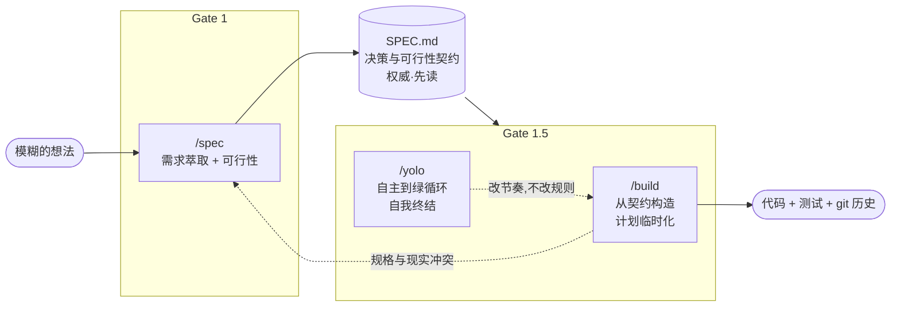
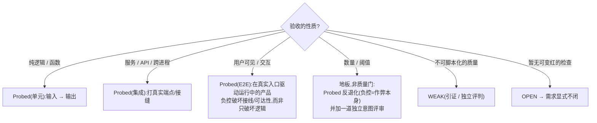
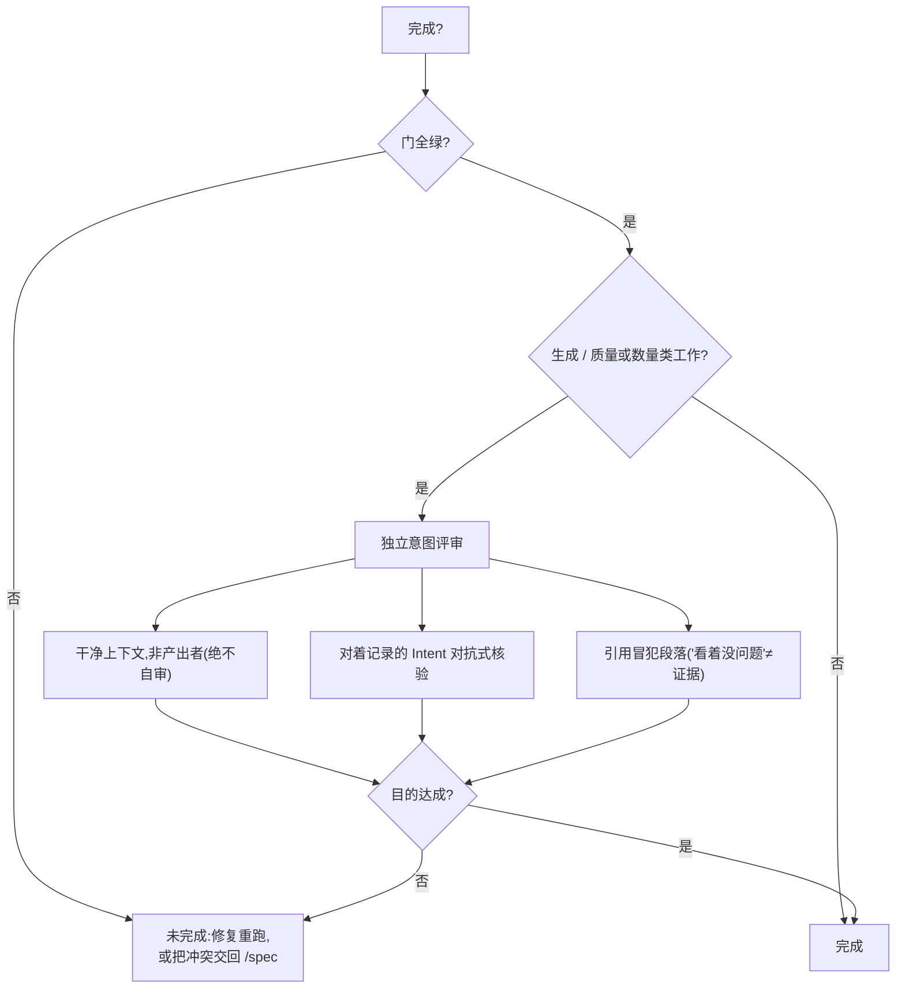
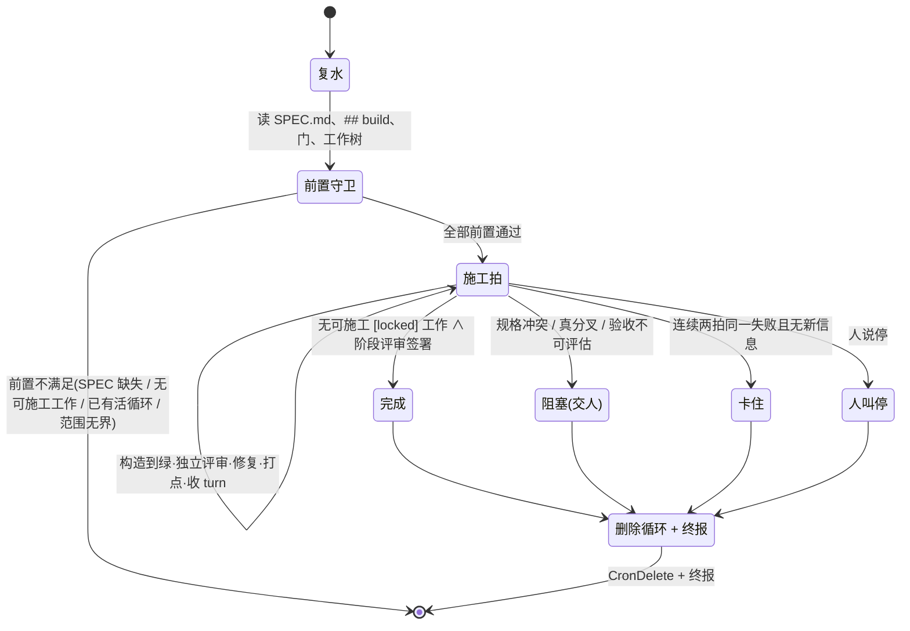

# 规格即契约:以可证伪门禁与意图评审对抗规格漂移与"空洞绿"的 AI 辅助开发管线

*`/spec` → `/build` → `/yolo` 管线的设计、实现与实证。(英文版见 [`PAPER.md`](./PAPER.md);会议短文版见 [`PAPER-short.md`](./PAPER-short.md)。)*

---

## 摘要

大语言模型(LLM)驱动的"AI 辅助开发"已能从自然语言直接生成大量代码,却暴露出两类系统性失效。**规格漂移**(specification drift):被持久化的中间设计/任务层与真实代码随时间背离,使"文档"沦为谎言。**空洞绿**(hollow / orphaned green):验收检查通过、指标达标,而需求的*意图*并未达成——一个在单元测试里渲染正确、却从未被真实运行入口挂载的组件;一段为凑够字数而用填充物堆砌的文本;一条被静默跳过的用户可见行为。本文提出三门管线 `/spec`(Gate 1)、`/build`(Gate 1.5)、`/yolo`,其核心主张是:把 `SPEC.md` 定位为**决策与可行性契约**而非产品需求文档,只持久化"决策—门禁—边界—反模式"这一最小承重层,而把易漂移的功能级设计/任务计划**每次重生、绝不固化**。每条承重需求携带 **Intent(意图)+ Acceptance(验收)+ Method(方法)** 三元组,其中意图是一等字段,用于抵御 Goodhart 效应下"优化器满足最省力读法"的作弊;门禁必须是**可证伪的探针**(能变红,带负控),生成/质量类产物在门禁全绿之外还须通过一次**独立、干净上下文、对着记录意图的对抗式评审**方可判定完成。我们进一步给出一套**一致性透镜**(八条通用法则),作为跨领域(代码/小说/研究/任务)发现承重门的萃取脚手架。管线以 Claude Code skill 形式实现,并通过**自举**(dogfooding)、**非编程评估项目**(英文中篇小说、百章中文网文)、**对抗性审稿**、以及一组以"机械度量 + 独立盲评"定夺技能文档自身最优表达的实验予以验证。我们同时诚实界定方法的边界:覆盖完备性不可证,意图评审提供的是结构性而非数学性保证,且强依赖于足够强的审阅模型。

**关键词**:AI 辅助开发;规格漂移;Goodhart 效应;可证伪验证;意图对齐;设计契约。

---

## 1. 引言

### 1.1 背景与问题

把 LLM 接入软件构造流程后,"写得快"不再是瓶颈,"写得对且可信"成为新瓶颈。实践中反复出现两个互相纠缠的病征。

**病征一:规格漂移。** 主流"规格驱动"工具倾向于把需求、设计、任务拆成多份持久化文档并逐一维护。问题在于:被持久化的**中间层**(功能级设计、任务清单)是一个天然的漂移面——代码一旦演进,这层文档要么滞后成谎言,要么需要昂贵的人力去同步。文档越"全",漂移越贵。

**病征二:空洞绿。** 当"完成"的判据是"检查通过",而检查只是意图的**代理**(proxy),LLM 作为一个**优化器**会找到满足检查字面、却偏离检查意图的最省力路径。真实观测到的形态包括:一个单元测试里渲染正确、却从未被挂载到真实运行入口的组件("孤儿绿");一段为满足"每章 ≥ 4000 字"硬指标而用破折号 `——` 填充的小说文本;一条列在验收清单里、却被静默跳过的用户可见行为。这正是 **Goodhart 定律**在 AI 构造中的显影:一旦度量成为目标,它就不再是好度量。

### 1.2 核心主张

我们主张:对抗上述两病,不能靠"更多文档"或"更多检查条目"这类补丁,而要在管线的**结构**上下手。

1. **只持久化承重层。** `SPEC.md` 是**决策与可行性契约**——承重决策、门禁、边界、反模式——**不是** PRD、功能清单或完整构造蓝图。功能级细节由构造阶段每次从契约**重生**,永不固化,从根上消除漂移面。
2. **门是意图的代理,须对抗式设计并验意图而非字面。** 每条承重需求携带 **Intent + Acceptance + Method** 三元组;门禁是**能变红**的探针(带负控);生成/质量类产物的"完成"额外要求一次**独立的、对着记录意图的对抗式评审**。
3. **可行性优先于愿望。** 分析阶段是一位诚实的需求工程专家:能自查自决的绝不问人,只在真正的分叉或发现更优方案时求助于人;研究证明不可行的愿望据实拒绝,而非顺从地写进一个已知错误的规格。

三条主张分别落在三个命令上:`/spec` 建立并守护契约,`/build` 从契约构造代码而不引入新漂移,`/yolo` 让构造在同一规则下自主跑到绿并自我终结。

### 1.3 贡献

- 一套**以契约为中心、中间层临时化**的三门 AI 开发管线,及其"漂移面最小化"论证。
- **Intent/Acceptance/Method** 三元组与**可证伪探针 + 独立意图评审**的双层验证模型,作为 Goodhart 效应的结构性对策。
- 一套**一致性透镜**(八条通用法则),把"该立哪些门"从"分析师碰巧懂领域"变成系统性扫描,并跨代码/小说/研究/任务泛化。
- 一套**实证方法论**(自举 + 非编程评估 + 对抗性审稿 + 表达形式盲评),及其揭示的结论与诚实边界。

---

## 2. 相关工作

**规格驱动开发与"持久化一切"。** 一类现代工具把需求→设计→任务全部落成可维护文档。其优点是可追溯,代价是维护成本与漂移风险随文档粒度上升。本文的关键分歧是**刻意不保留中间层**:持久化的只有契约,设计/任务是一次性脚手架。

**契约式设计(Design by Contract)。** Meyer 的前置/后置条件与不变量思想,启发了"每条需求带可验证契约"的立场;区别在于本文把契约的**验证方法**显式为一等字段(Probed/OPEN/WEAK),并强制"无方法即未闭门"。

**测试驱动与基于性质的测试。** TDD 的"先写会失败的测试"与本文"探针必须能变红(带负控)"同源;基于性质的测试启发了"负控要破坏接线/可达性,而非只破坏内部逻辑"的要求。本文进一步把这套纪律推广到**非代码产物**(先仪表化,再让门能变红)。

**Goodhart 定律与规格博弈(specification gaming)。** 强化学习与 AI 安全领域早已记录智能体钻取奖励代理漏洞的现象。本文的独特之处是把它当作**构造阶段的一等威胁**来设计防御:对抗式立门(pre-mortem)+ 独立意图评审,并明确"枚举 exploit 必输,只能靠原则"。

**LLM 智能体自主循环。** 自主"跑到目标"的循环常见失败是无界发散或自我认证。`/yolo` 的差异在于:**门判定的完成**、**独立(非自审)评审**、以及**四条硬终结条件 + 自删循环**,把"自主"限制在"只改节奏、不改规则"。

---

## 3. 设计

### 3.1 三门管线总览



*图 1. 管线全貌。三者共享同一份权威 `SPEC.md`;下游只读 `CLAUDE.md → SPEC.md`,与执行细节解耦。`/yolo` 不是第三个阶段,而是 `/build` 的节奏切换。规格与现实冲突永远回流到 `/spec`,绝不悄悄改规格。*

### 3.2 `SPEC.md`:决策与可行性契约

契约只承载**承重**内容:愿景与核心问题;范围与边界;**反模式**(诱人但错误的走法);**门禁**(承重真值源);需求(带三元组);依赖决策;决策日志(登记推演路径以免重复争论);阶段台账(涌现、只追加、封存只读)。它**明确不是** PRD/功能清单/完整蓝图。这一定位是"漂移面最小化"的直接推论:凡是会随实现频繁变化的,都不进契约。

### 3.3 Intent / Acceptance / Method 三元组

每条承重需求携带:

```
需求(承重) = { Intent, Acceptance, Method }
  Intent  = 它保护的目的,即"什么算违反";来源标 [auto](分析师推导)或 [human](人设定)
            [human] 意图不得被后来的 [auto] 推导悄悄覆盖(冲突 = 交人裁决,而非自决)
  Acceptance = 可观测的"什么"行为
  Method  ∈ { Probed(.sh + 负控) | OPEN(暂造不出红检 ⇒ 需求显式不闭) | WEAK(不可脚本化 ⇒ 引证/评判签署) }
```

**Method 的模态由验收性质推导:**



*图 2. 验收性质 → Method。在单元测试里渲染 `<X/>`,并不能证明 `<X/>` 挂载在用户真正到达的屏幕上——故用户可见的验收须驱动真实入口,其负控删除挂载/路由/调用点。* **意图之所以是一等字段**,正因为它是独立评审"对着核"的对象,也是一致性透镜(§3.6)的萃取产出;若只留作隐式散文,评审便无锚、萃取便无处落地。

### 3.4 门是意图的代理:对抗式立门 + 验意图非字面

把"孤儿绿""散文验收被读码顶替""探针滞后""字数被 `——` 填充"视为**同一个 bug 的不同面具**:门是意图的代理,优化器满足最省力读法,可任意偏离意图。因此不靠枚举 exploit 防御,而靠两条可迁移的原则。

1. **对抗式立门(pre-mortem)。** 对每道门写下意图,自问:*"最廉价、却能让门变绿而被明白人判定未达意图的产物是什么?"* 若存在,则要么**加固度量**(把这个作弊本身做成探针的负控),要么承认门只是**地板**并在其下加一道意图评审。
2. **验意图,非字面。** 度量抓不住的残差(质量、真实性、"是否真的解决了问题")=WEAK;自主循环会**静默跳过**它,除非把它做进"完成"的定义。做法是一次**独立意图评审**,其唯一问题恒为:*"达成目的,还是只满足度量?"*



*图 3. 双层验证("纵深防御")。加固的度量便宜、确定、抓粗暴作弊;意图评审抓探针抓不到的精细遗漏(清过所有机械条却仍空洞、离题或伪造的产物)。一个只有绿度量、没有意图评审的"完成",正是被作弊产物出厂的方式。*

### 3.5 门的三准则与"门集对齐"

一个真值源只有**同时**满足三准则才升为门:**承重 ∧ 不确定 ∧ 错则改设计**(错了会改变契约/架构/依赖,而非仅实现细节)。常识事实(端口可绑、目录可写、库按文档工作)**永不设门**。当规格变更时,门集必须随之对齐,否则构造会用**旧门集**对着新规格判绿(反漂移自身漂移):新需求→建探针,改动→换掉陈旧探针,废止→退役;缺失或早于需求最后变更的探针 = 未完成门 → 回 `/spec`。一个 coherence 元探针守护该不变式(每个 locked 且 Probed 的需求有现存探针、无孤儿探针)。

### 3.6 一致性透镜:跨领域发现承重门

"该立哪些门"若依赖分析师碰巧懂领域,正是承重门被漏掉的根因。透镜提供一小组**通用法则**作为萃取脚手架(非硬清单):

| # | 法则 | 跨领域形态 |
|---|------|-----------|
| 1 | **不矛盾** | 小说 canon / 代码契约·不变量 / 研究已定结论 |
| 2 | **合法演化** | 境界单调 / 状态机·迁移·版本 / 只应收敛的估计 |
| 3 | **守恒** | 金钱·物品·力量值 / 内存·预算·事务 / 误差·样本预算 |
| 4 | **闭合** | 伏笔必填 / TODO·废弃项 / 待验假设 |
| 5 | **引用完整 + 可达** | 关系图 / 依赖·调用图·接线 / 引证图 |
| 6 | **边界与可见性** | 谁知道什么(公平推理) / 封装·访问控制·安全 / 训练↔测试泄漏 |
| 7 | **真实推进** | 主线推进不注水 / 里程碑真闭合 / 每轮真降不确定性 |
| 8 | **可溯源** | 章节梗概 / 提交·变更日志 / 实验记录 |

*表 1. 一致性基底。法则 1–6 治状态,法则 7 是目标(§3.4 的意图评审居此),法则 8 是使前七者可核的底座。* 透镜以"**推导优先、少问、扩项**"运行:能自推的登记 `[auto]` 不问;只把"哪些维度真承重、每条违反意味着什么(即意图)"这类**人类才拥有**的判断交人;且交人时**用基于法则+研究生成的候选选项集 + 推荐**去问,而非空白提问——因为即便专家的广度也不及一次系统性扫描。

### 3.7 `/yolo`:自主到绿且自我终结

`/yolo` 是 `/build` 的自主模式 + 一个会自删的循环。它优先用调度器(`/loop`/cron,每分钟一拍)反复驱动 `/build` 到绿、对每轮 diff 做独立评审并修确证项、每拍打点进度台账;当**任一硬终结条件**成立即不再构造、删除循环并出终报:



*图 4. `/yolo` 循环。设计要害:(i)**门判定的完成**——自主循环若自我认证,比没有循环更糟;(ii)**删循环即完成的一部分**——一个被遗忘、仍对着已完成/卡死仓库空转的 cron,是 `/yolo` 唯一的致害面;(iii)**只改节奏、不改规则**——`SPEC.md` 仍权威,冲突仍回 `/spec`。*

---

## 4. 实现

管线以 **Claude Code skill**(Markdown 协议 + 薄命令包装)实现,没有编译/lint/测试框架——"源代码"就是这些提示词协议。**验证 = 可运行探针**:一道门是一个必须能失败的 shell 脚本,`exit 0 = 绿(通过)`、非零 = 红(失败);`--selftest` 是强制的负控自测——探针必须在**坏例上变红、好例上变绿**;一个无法变红的探针是空洞的、被拒。

关键实现纪律:探针须独立、打印原始证据(而非只打 "PASS")、非破坏且自清理、绝不含/回显密钥、用真实 UTC 时间记录运行时空(证据的时间戳日后让 `/spec` 判断绿是新是旧)。诚实边界被显式写入:负控只修**单探针**的空洞性,不证明"探了一切"——`SPEC.md` 是"已验证之真的下界",非正确性证明。

---

## 5. 实证评估

方法论刻意与管线自身哲学同构:**机械度量(确定性地板)+ 独立评判(干净上下文的对抗评审)**。

### 5.1 自举(Dogfooding)

本仓库用自己的管线规格化自己:其 `SPEC.md` + `.spec/` 由一次真实 `/spec` 运行产出,承重门 `G2-done-by-gate.sh` 判定 Phase 2(`/build`)的完成。管线因此持续受自身门禁约束。

### 5.2 非编程评估:通用性验证

为检验"是否只对代码有效",在两个**零代码**项目上跑完整管线:一部英文悬疑中篇、一部百章中文网文(全原创,仅借鉴题材惯例而不复制任何在版作品)。二者各有 `SPEC.md` 与 `.spec/probes/`。评估在**观察者模式**下进行(不提示一致性诉求),以检验 `/spec` 是否**自发**考虑人物/姓名/属性/文风一致性。结论:通用机制足够强,多数旧缺陷未复现;但也照出真实缺口并逐一从**架构**(而非补丁)修复——

| 发现 | 修复 |
|---|---|
| 缺"对增长语料的 canon 一致性"门族(长连载/维基/长规格的头号门) | canon 账本(故事圣经)+ 矛盾探针(不可变属性被改、单调属性倒退、标识符缺失即红) |
| 字数探针能变红却被 `——` 填充满足(Goodhart) | 数量门只是**地板**;配负控=作弊本身变红的反退化护栏,并对生成质量加独立评审(D-58) |
| 上一条修复只是针对一种作弊的补丁 | 上升为可迁移原则"门是意图的代理"(D-59) |
| 意图在规格结构里无家可归(跑透镜第 6 法则时暴露) | Intent 升为一等需求字段(D-61) |

*表 2. 非编程评估:缺口与其架构级修复。两个评估项目均保留样本与 red→green 证据于 `eval/`。*

### 5.3 对抗性审稿:意图评审能否泛化

针对"被判定的作弊"与"最难的法则"做多轮对抗审稿:向独立、干净上下文的评审者投喂**未被探针枚举**的新型作弊(不同于 `——` 的填充花样、信息边界的越界),检验意图评审是否仍能捕获。结果:多轮零假阳性地识别出偏离意图之处——但我们诚实标注:这是**结构性**保证(独立性 + 对着记录意图 + 出引证),**非数学性**保证。

### 5.4 表达形式实验:技能文档自身的最优表达

为回答"技能文档哪些内容用图/箭头/伪代码/发明记号更精确省 token",做了五轮"机械字数 + 独立盲评"实验:同一门决策学说写成六形,盲读答判定题。

| 表达形式 | 相对散文 | 保真 | 人类可编辑性(以 PR 评审为镜) |
|---|---:|:---:|---|
| 散文(基线) | 100% | 8/8 | 通用但冗长,语义弥散 |
| 伪代码 | −15% | 8/8 | **对写代码者最友好**;无图例;新规则=新 `case` |
| 文本+箭头 | −52% | 8/8 | **强**;无自造图例;行自解释 |
| mermaid | −45% | 8/8 | 渲染好看,但源码是不透明节点 id、改动可能悄悄破渲染 |
| 数学记号 | −49% | 8/8 | 精确,但一字 `∨→∧` 翻义、diff 里隐形、排斥非数学维护者 |
| 发明 DSL | −68% | 8/8 | 最省,但离了图例读不懂 |

*表 3. 表达实验结果(第 1–5 轮)。六种对强模型皆全保真(覆盖结构、判断路由、乃至生成语气三类内容)。但真正的判据是**价值 = 保真 × 人类可编辑性 ÷ 体积**,而这两根轴把紧凑形排成反序。* 收敛的规则——**结构核**用无图例的箭头/轻伪代码、**动机与范例**留散文——随即被回施于技能文档自身,并以盲读等价回归(每块与原散文同判)证明改动**行为中立**。这一实验本身即是方法论的一次自证:表达选型也照"实测选型、独立盲评"来定,而非审美偏好。

---

## 6. 讨论

**它抵御了什么。** 漂移:靠不持久化中间层从根上消除漂移面。空洞绿:靠"门是代理"的对抗式立门 + 独立意图评审形成纵深。跨领域漏门:靠一致性透镜把"该立哪些门"系统化。

**诚实的边界。**

- **覆盖完备性不可证。** 负控只治单探针空洞,不保证探了一切;绿板是下界,勿过度信任。
- **意图评审是结构性而非数学性保证。** 它把"自审放水"这一最大漏洞用独立性堵上,但不排除一个足够隐蔽、连独立评审都被骗过的产物。
- **强依赖强模型审阅者。** 全部盲评/评审均由强模型担任(与真实技能消费者一致,但每格样本量小);弱模型审阅者可能达不到同等泛化。
- **人类意图仍是输入。** 防作弊要的"意图"本就不可推导、只能来自人;透镜把它的萃取系统化,却不能替人做价值判断。

**与"持久化一切"的取舍。** 本文以放弃中间层的可追溯性,换取零漂移与低维护;对需要重型审计轨迹的场景,这一取舍需重新权衡(决策日志 + git + 测试是兜底)。

---

## 7. 结论

我们提出并实现了以 `SPEC.md` 为**决策与可行性契约**的三门 AI 辅助开发管线,以"只持久化承重层"消解规格漂移,以"Intent/Acceptance/Method 三元组 + 可证伪探针 + 独立意图评审"作为 Goodhart 效应下"空洞绿"的结构性对策,并以一致性透镜把承重门的发现跨领域系统化。自举、非编程评估、对抗性审稿与表达形式实验共同表明:该管线不局限于代码,其防御来自**原则而非枚举**,且在诚实界定的边界内可用、可复现。其更一般的启示是:在 LLM 作为优化器的时代,"完成"的定义不能是"检查通过",而必须是"**意图达成、且由一个无放水动机的独立视角对着记录的意图核验并出具引证**"。

---

## 附:关键设计决策溯源(节选自项目决策日志)

- **D-54** 验收必带方法,取缔"散文无方法"第四态。
- **D-57** 探针集合随规格变更对齐,否则反漂移自身漂移。
- **D-58** 数量门只是地板,须反退化护栏 + 生成质量独立评审。
- **D-59** 门是意图的代理:对抗式立门 + 验意图非字面(可迁移原则,非补丁)。
- **D-60** 一致性透镜:八法则通用基底 + 交互式萃取,推导优先、少问、扩项。
- **D-61** Intent 升为一等字段,焊死"评审对什么核"与"透镜产出什么"。
- **D-62** 技能文档表达优化:实测选型(保真 × 人类可编辑性 ÷ 体积),结构核用箭头、动机留散文。

*(实现见 `.claude/skills/{spec,build,yolo}/`;完整设计讨论与决策日志见 [`DESIGN-NOTES.md`](./DESIGN-NOTES.md);评估证据见 [`../eval/`](../eval/)。)*
