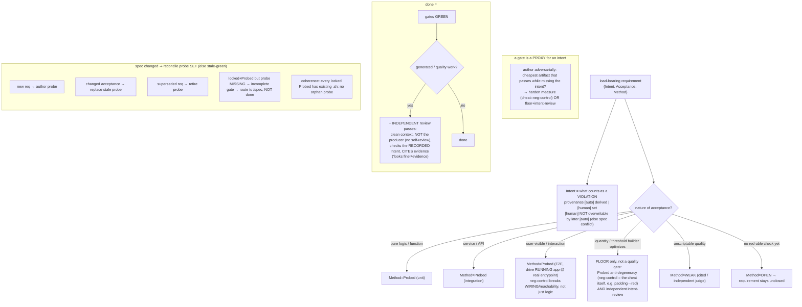

Every load-bearing requirement = { Intent, Acceptance, Method }.

```mermaid
flowchart TD
  R["load-bearing requirement<br/>{Intent, Acceptance, Method}"]
  R --> I["Intent = what counts as a VIOLATION<br/>provenance [auto] derived | [human] set<br/>[human] NOT overwritable by later [auto] (else spec conflict)"]
  R --> K{"nature of acceptance?"}
  K -->|pure logic / function| U["Method=Probed (unit)"]
  K -->|service / API| N["Method=Probed (integration)"]
  K -->|user-visible / interaction| E["Method=Probed (E2E, drive RUNNING app @ real entrypoint)<br/>neg-control breaks WIRING/reachability, not just logic"]
  K -->|quantity / threshold builder optimizes| Q["FLOOR only, not a quality gate:<br/>Probed anti-degeneracy (neg-control = the cheat itself, e.g. padding→red)<br/>AND independent intent-review"]
  K -->|unscriptable quality| W["Method=WEAK (cited / independent judge)"]
  K -->|no red-able check yet| O["Method=OPEN → requirement stays unclosed"]

  subgraph GATE["a gate is a PROXY for an intent"]
    direction TB
    ADV["author adversarially: cheapest artifact that passes while missing the intent?<br/>→ harden measure (cheat=neg-control) OR floor+intent-review"]
  end

  subgraph DONE["done ="]
    direction TB
    D1["gates GREEN"] --> D2{"generated / quality work?"}
    D2 -->|yes| REV["+ INDEPENDENT review passes:<br/>clean context, NOT the producer (no self-review),<br/>checks the RECORDED Intent, CITES evidence ('looks fine'≠evidence)"]
    D2 -->|no| OK["done"]
  end

  subgraph CHANGED["spec changed ⇒ reconcile probe SET (else stale-green)"]
    direction TB
    C1["new req → author probe"]
    C2["changed acceptance → replace stale probe"]
    C3["superseded req → retire probe"]
    C4["locked+Probed but probe MISSING → incomplete gate → route to /spec, NOT done"]
    C5["coherence: every locked Probed has existing .sh; no orphan probe"]
  end
```
